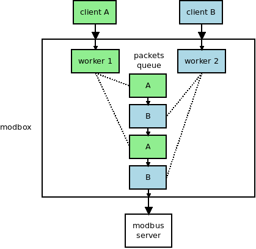

# Introduction

A proxy server use time-division multiplexing to deliver packets to the modbus/tcp server.

# Getted Started

1.  Install

    The [nitrogen compiler](https://github.com/xsoameix/nitrogen)
    is used to generate c code, please install it first.

        $ cmake .
        $ make

2.  Then you can simply run server:

        $ ./modbox
        Listening on 127.0.0.1:60000

Press Ctrl + C or send SIGTERM to shutdown the server.

# Environment Variables

`SENDER_ADDR` and `SENDER_PORT` assign the address and port of the server.

    $ SENDER_ADDR=127.0.0.1 SENDER_PORT=40000 ./modbox
    Listening on 127.0.0.1:40000

    $ SENDER_ADDR=::1 SENDER_PORT=40000 ./modbox
    Listening on ::1:40000

`CONNECT_ADDR` and `CONNECT_PORT` assign the address and port of the client.

    $ CONNECT_ADDR=192.168.1.1 CONNECT_PORT=400 ./modbox

# Test

Please install ruby and nodejs first.

    $ npm install -g livescript
    $ npm install
    $ ./scripts/test_worker.sh
    $ ./scripts/test_server.ls
    $ ./scripts/test_client
